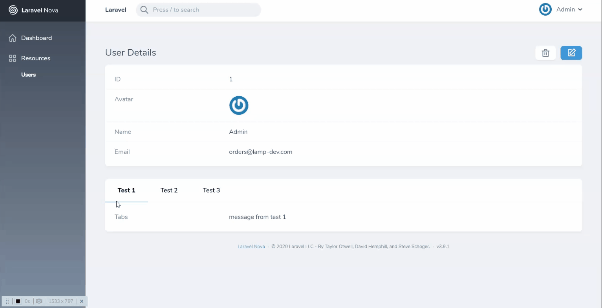

# Nova Tabs Field

Simple [Laravel Nova](https://nova.laravel.com) Tabs field.

### Detail View



## Installation

Install the package in a Laravel Nova project via Composer:

```bash
composer require lampdev/tabs
```

## Usage

The `Tabs` field provides a convenient interface to display tabs.

```php
use Lampdev\Tabs\Tabs;

public function fields(Request $request)
{
    return [
        ....

        Tabs::make('Name', [
            'Test 1' => 'message from test 1',
            'Test 2' => 'message from test 2',
            'Test 3' => 'message from test 3'
        ]),
    ];
}
```
